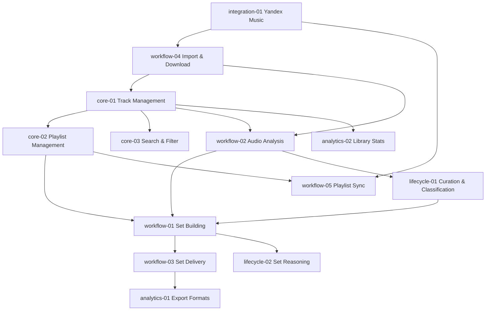

# Feature Specifications — DJ Music Plugin

## Dependency Graph

## Feature Index

| ID | Phase | Feature | Status | File |
|----|-------|---------|--------|------|
| core-01 | Core | Track Management | completed | [core-01-track-management.md](core-01-track-management.md) |
| core-02 | Core | Playlist Management | completed | [core-02-playlist-management.md](core-02-playlist-management.md) |
| core-03 | Core | Search & Filter | completed | [core-03-search-filter.md](core-03-search-filter.md) |
| workflow-01 | Workflow | Set Building & Optimization | completed | [workflow-01-set-building.md](workflow-01-set-building.md) |
| workflow-02 | Workflow | Audio Analysis Pipeline | completed | [workflow-02-audio-analysis.md](workflow-02-audio-analysis.md) |
| workflow-03 | Workflow | Set Delivery & Export | completed | [workflow-03-set-delivery.md](workflow-03-set-delivery.md) |
| workflow-04 | Workflow | Import & Download | completed | [workflow-04-import-download.md](workflow-04-import-download.md) |
| workflow-05 | Workflow | Playlist Sync | completed | [workflow-05-playlist-sync.md](workflow-05-playlist-sync.md) |
| lifecycle-01 | Lifecycle | Curation & Classification | completed | [lifecycle-01-curation.md](lifecycle-01-curation.md) |
| lifecycle-02 | Lifecycle | Set Reasoning | completed | [lifecycle-02-set-reasoning.md](lifecycle-02-set-reasoning.md) |
| integration-01 | Integration | Yandex Music API | completed | [integration-01-yandex-music.md](integration-01-yandex-music.md) |
| analytics-01 | Analytics | Export Formats | completed | [analytics-01-export-formats.md](analytics-01-export-formats.md) |
| analytics-02 | Analytics | Library Statistics | completed | [analytics-02-library-stats.md](analytics-02-library-stats.md) |

## Domain Codes

| Code | Domain |
|------|--------|
| TRK | Tracks |
| PLS | Playlists |
| SET | DJ Sets |
| AUD | Audio Analysis |
| CUR | Curation |
| DLV | Delivery |
| IMP | Import/Download |
| SYN | Sync |
| YM | Yandex Music |
| RSN | Set Reasoning |
| EXP | Export |
| LIB | Library Stats |
| SRC | Search |
