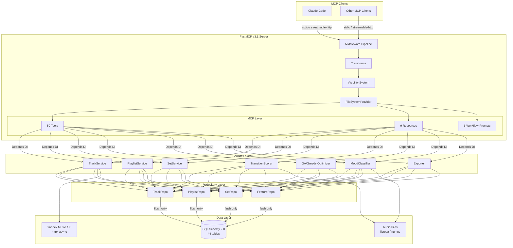
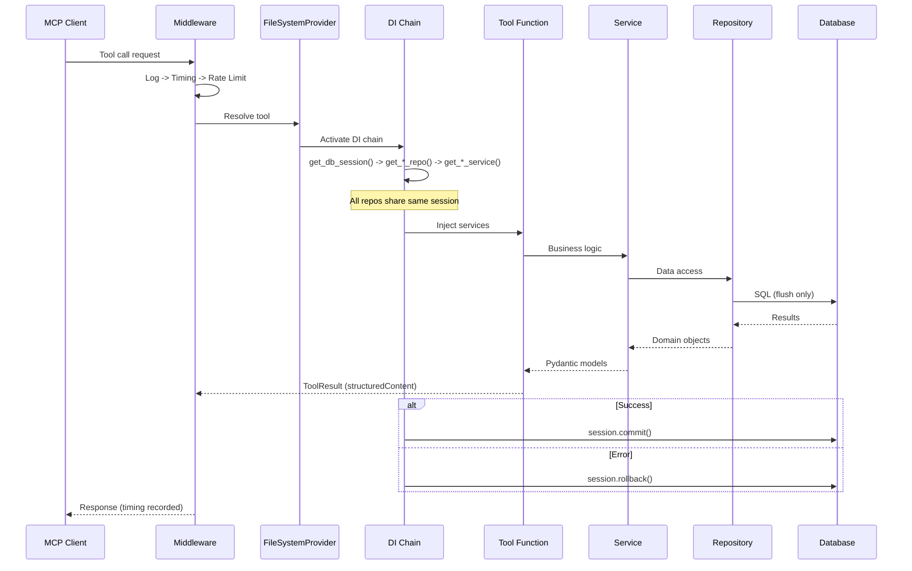
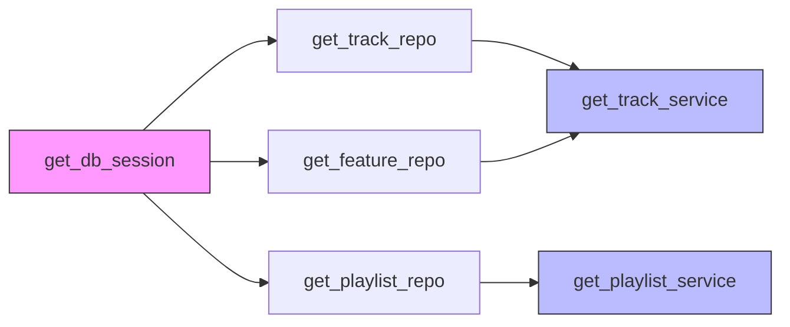
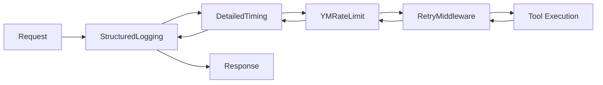
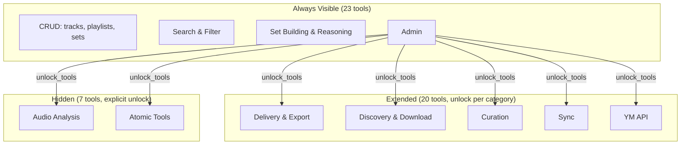
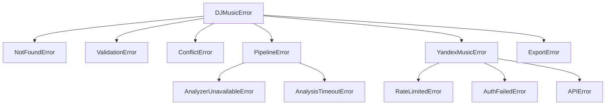

# Architecture

## Overview

DJ Music Plugin follows a strict layered architecture where each layer imports only the layer below. The MCP server is built on FastMCP v3.1 with FileSystemProvider for zero-boilerplate tool auto-discovery.



## Layer Rules

| Layer | Directory | Imports | Responsibility |
|-------|-----------|---------|---------------|
| **Models** | `app/models/` | SQLAlchemy only | Data structure definitions (44 tables) |
| **Repositories** | `app/repositories/` | Models | Data access. **Flush only, never commit** |
| **Services** | `app/services/` | Repositories, Models | Business logic. Domain errors, no MCP imports |
| **MCP Tools** | `app/mcp/tools/` | Services (via DI) | Thin MCP wrappers with `@tool` decorator |
| **MCP Resources** | `app/mcp/resources/` | Services (via DI) | Read-only data views with `@resource` decorator |
| **MCP Prompts** | `app/mcp/prompts/` | None (pure templates) | Workflow prompt templates |
| **Audio** | `app/audio/` | Models | Audio analysis (optional deps) |
| **YM Client** | `app/ym/` | None | Async Yandex Music HTTP client |
| **Core** | `app/core/` | None | Shared: errors, constants, pagination, entity resolver |

> **Rule:** Each layer imports only the layer below. Tools -> Services -> Repositories -> Models.

## Data Flow: Tool Call Lifecycle



## Dependency Injection

All services and repositories are injected via FastMCP's `Depends()` system. A single DB session is shared across all services within one tool call.

```python
from fastmcp.tools import tool
from fastmcp.dependencies import Depends

@tool(tags={"core"}, annotations={"readOnlyHint": True})
async def my_tool(
    id: int,
    view: Literal["summary", "full"] = "summary",
    svc=Depends(get_my_service),       # param=Depends() pattern
) -> MyModel:
    """Short description."""
    return await svc.get(id, view=view)
```

### DI Chain



> **Important:** Use `param=Depends(factory)`, NOT `Annotated[Type, Depends(factory)]` -- FastMCP does not resolve the Annotated pattern.

### Transaction Boundary

- **Repositories:** `await self.session.flush()` (never commit)
- **DI wrapper** `get_db_session()`: commit on success, rollback on failure
- This ensures one transaction per tool call across all repos

## Middleware Pipeline



| Middleware | Purpose |
|-----------|---------|
| `StructuredLoggingMiddleware` | Logs tool calls with optional payload logging |
| `DetailedTimingMiddleware` | Records execution time per tool |
| `YMRateLimitMiddleware` | Enforces rate limiting for YM API calls |
| `RetryMiddleware` | Retries failed tool calls (max 2 retries) |

## Transforms

```python
mcp.add_transform(ResourcesAsTools(mcp))  # Resources exposed as tools
mcp.add_transform(PromptsAsTools(mcp))    # Prompts exposed as tools
```

This enables tool-only clients (like Claude Code) to access resources and prompts as regular tool calls.

## Visibility System

Tools are organized into three visibility tiers to reduce token overhead (~5K vs ~9K context):



Usage:
```python
unlock_tools(action="unlock", category="discovery")  # Unlock discovery tools
unlock_tools(action="status")                         # Check what's unlocked
unlock_tools(action="lock", category="audio")         # Re-hide audio tools
```

## Server Lifespans

Four lifespans manage resource lifecycles:

| Lifespan | Provides | Cleanup |
|----------|----------|---------|
| `db_lifespan` | DB engine + session factory | `engine.dispose()` |
| `ym_lifespan` | YM client + rate limiter | `client.close()` |
| `analyzer_lifespan` | Audio analyzer registry | -- |
| `cache_lifespan` | Transition score cache | `cache.clear()` |

```python
mcp = FastMCP(
    lifespan=db_lifespan | ym_lifespan | analyzer_lifespan | cache_lifespan,
    ...
)
```

## FileSystemProvider

Auto-discovers `@tool`, `@resource`, and `@prompt` decorated functions from all Python files in `app/mcp/`:

```
app/mcp/
├── tools/          # 17 files, 50 tools
│   ├── tracks.py   # list_tracks, get_track, manage_tracks, get_track_features
│   ├── playlists.py
│   ├── crud.py     # sets CRUD
│   ├── search.py
│   ├── sets.py     # build_set, rebuild_set, score_transitions
│   ├── reasoning.py
│   ├── admin.py
│   ├── delivery.py
│   ├── discovery.py
│   ├── import_download.py
│   ├── curation.py
│   ├── sync.py
│   ├── ym.py
│   ├── audio.py
│   └── audio_atomic.py
├── resources/      # 3 files, 9 resources
│   ├── status.py
│   ├── templates.py
│   └── reference.py
└── prompts/        # 1 file, 6 prompts
    └── workflows.py
```

No manual imports needed -- new tools are discovered automatically.

## Error Hierarchy



- **Services** raise domain errors (`NotFoundError`, `ValidationError`)
- **Tools** raise `ToolError` for input validation
- Production mode masks error details: `mask_error_details=not settings.debug`

## Key Architectural Decisions

| Decision | Rationale |
|----------|-----------|
| FileSystemProvider over manual registration | Zero boilerplate, hot reload in dev |
| `Depends()` for DI over global state | Per-request session scoping, testable |
| Services != Tools | Services are framework-agnostic, reusable outside MCP |
| Repos flush, never commit | Transaction boundary at tool level via DI |
| Pydantic models for tool returns | Automatic `structuredContent`, type-safe |
| Settings class over raw env vars | Type-checked, documented defaults, testable |
| Visibility tiers | ~5K tokens in context vs ~9K, better Claude accuracy |
| `TrackFeatures.from_db()` classmethod | Single source of truth for DB->dataclass mapping |
| `FeatureRepository` batch methods | N SQL queries -> 1 for scoring loops |

## Related Pages

- **[MCP Tools Reference](MCP-Tools-Reference)** -- All 50 tools
- **[Configuration Reference](Configuration-Reference)** -- All settings
- **[Contributing](Contributing)** -- Code patterns and conventions
