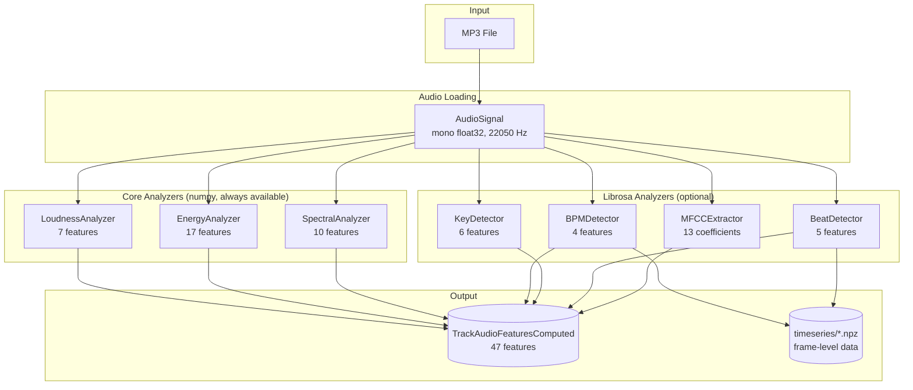
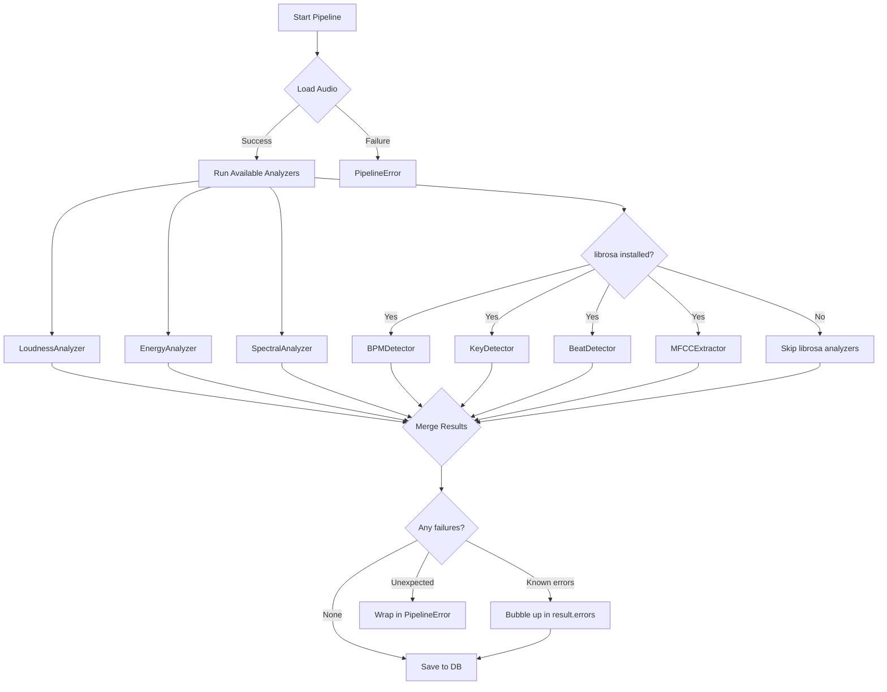

# Audio Analysis Pipeline

## Overview

The audio analysis pipeline extracts 47 numerical features from audio files using 7 analyzers. It supports partial failures, optional dependencies, and persists results to the database.



## Analyzer Registry

The plugin-based architecture uses a registry that auto-discovers available analyzers based on installed packages.

| Analyzer | Package | Features | Count |
|----------|---------|----------|-------|
| **LoudnessAnalyzer** | numpy (core) | integrated_lufs, short_term_lufs_mean, momentary_max, rms_dbfs, true_peak_db, crest_factor_db, loudness_range_lu | 7 |
| **EnergyAnalyzer** | numpy (core) | mean, max, std, slope, 7-band breakdown (sub, low, lowmid, mid, highmid, high), ratios | 17 |
| **SpectralAnalyzer** | numpy (core) | centroid_hz, rolloff_85, rolloff_95, flatness, flux_mean, flux_std, slope, contrast, hnr_db, chroma_entropy | 10 |
| **BPMDetector** | librosa | bpm, tempo_confidence, bpm_stability, variable_tempo | 4 |
| **KeyDetector** | librosa | key_code, key_confidence, atonality, chroma_vector | 4 (+vector) |
| **BeatDetector** | librosa | onset_rate, pulse_clarity, kick_prominence, hp_ratio, beat_positions | 5 |
| **MFCCExtractor** | librosa | mfcc_vector (13 coefficients) | 13 |

**Total:** 47 scalar features + vectors

### Planned (Not Yet Implemented)

| Analyzer | Package | Purpose |
|----------|---------|---------|
| GrooveAnalyzer | -- | Rhythmic complexity, swing metrics |
| StructureAnalyzer | -- | Section boundaries (intro, drop, breakdown, outro) |
| StemSeparator | demucs + torch | Vocals, drums, bass, other separation |

## Analyzer Interface

Each analyzer implements the `BaseAnalyzer` abstract class:

```python
class BaseAnalyzer(ABC):
    name: str                          # e.g., "bpm"
    capabilities: set[str]             # e.g., {"tempo", "rhythm"}
    required_packages: list[str]       # e.g., ["librosa"]

    @abstractmethod
    async def analyze(self, audio: AudioSignal) -> AnalyzerResult:
        """Run analysis on audio signal."""
        ...

    def is_available(self) -> bool:
        """Check if required packages are installed."""
        ...
```

## Audio Signal

The audio is loaded once per pipeline run and shared across all analyzers:

```python
@dataclass
class AudioSignal:
    samples: np.ndarray       # mono float32
    sample_rate: int          # settings.audio_sample_rate (22050)
    duration_seconds: float
    file_path: Path
```

## Pipeline Orchestration

```python
pipeline = AnalysisPipeline(registry)
result = await pipeline.analyze(audio_path, track_id)

# result.features: dict of 47 computed features
# result.sections: list of detected sections
# result.errors: list of {analyzer, error} for failed analyzers
# result.pipeline_run_id: FK to feature_extraction_runs table
```

### Partial Failure Handling



### Feature Filtering

When saving pipeline results to the database, always filter through `TrackAudioFeaturesComputed.filter_features()` to prevent key mismatches:

```python
# Pipeline may return keys that don't match DB columns
filtered = TrackAudioFeaturesComputed.filter_features(result.features)
# Now safe to pass to SQLAlchemy
```

> **Gotcha (BUG-002):** Pipeline analyzers may return keys like `energy_band_sub` that don't match the DB column `energy_sub`. The `filter_features()` classmethod handles this. See [Known Issues](Known-Issues#bug-002).

## Feature Groups

### Tempo (4 features)

| Feature | Range | Description |
|---------|-------|-------------|
| `bpm` | 20-300 | Beats per minute |
| `tempo_confidence` | 0-1 | How sure the detector is |
| `bpm_stability` | 0-1 | Consistency of tempo across the track |
| `variable_tempo` | bool | Track has tempo changes |

### Loudness (7 features)

| Feature | Typical Range | Description |
|---------|--------------|-------------|
| `integrated_lufs` | -20 to -4 | Overall loudness (LUFS standard) |
| `short_term_lufs_mean` | -25 to -2 | Average of 3-second windows |
| `momentary_max` | -15 to 0 | Peak loudness moment |
| `rms_dbfs` | -30 to -5 | RMS energy in dBFS |
| `true_peak_db` | -5 to 0 | True peak level |
| `crest_factor_db` | 3 to 30 | Peak-to-RMS ratio (dynamics) |
| `loudness_range_lu` | 1 to 25 | Dynamic range in LU |

### Energy (17 features)

| Feature | Description |
|---------|-------------|
| `energy_mean`, `energy_max`, `energy_std` | Overall energy statistics |
| `energy_slope` | Energy trend over time |
| `energy_sub` | Sub-bass energy (<60 Hz) |
| `energy_low` | Low energy (60-250 Hz) |
| `energy_lowmid` | Low-mid energy (250-500 Hz) |
| `energy_mid` | Mid energy (500-2000 Hz) |
| `energy_highmid` | High-mid energy (2-6 kHz) |
| `energy_high` | High energy (6-20 kHz) |
| `energy_*_ratio` | Ratio of each band to total |

> **Gotcha:** Column names are `energy_sub`, `energy_lowmid`, `energy_highmid` (NOT `energy_band_*` or `energy_low_mid`).

### Spectral (10 features)

| Feature | Description |
|---------|-------------|
| `spectral_centroid_hz` | "Brightness" of the sound |
| `spectral_rolloff_85` | Frequency below which 85% of energy lies |
| `spectral_rolloff_95` | Frequency below which 95% of energy lies |
| `spectral_flatness` | How noise-like vs tonal (0 = tonal, 1 = noise) |
| `spectral_flux_mean`, `spectral_flux_std` | Rate of spectral change |
| `spectral_slope` | Slope of spectrum (dB/octave) |
| `spectral_contrast` | Peak-to-valley difference (dB) |
| `hnr_db` | Harmonic-to-noise ratio |
| `chroma_entropy` | Chromatic complexity |

### Key (4 features + vector)

| Feature | Description |
|---------|-------------|
| `key_code` | Musical key (0-23, maps to 24 Camelot keys) |
| `key_confidence` | Detection confidence (0-1) |
| `atonality` | Flag for atonal tracks |
| `chroma_vector` | 12-bin chroma representation (stored separately) |

### Rhythm (5 features + vector)

| Feature | Description |
|---------|-------------|
| `hp_ratio` | Harmonic-to-percussive ratio (unbounded) |
| `onset_rate` | Onsets per second |
| `pulse_clarity` | How clear the beat pulse is |
| `kick_prominence` | Strength of kick drum |
| `mfcc_vector` | 13 MFCC coefficients (audio "fingerprint") |

## Mood Classification

### 15 Techno Subgenres

The rule-based mood classifier assigns each track to one of 15 subgenres ordered by energy intensity:

```mermaid
graph LR
    subgraph "Low Energy"
        A[ambient_dub]
        B[dub_techno]
        C[minimal]
    end

    subgraph "Medium Energy"
        D[detroit]
        E[melodic_deep]
        F[progressive]
        G[hypnotic]
        H[driving]
    end

    subgraph "High Energy"
        I[tribal]
        J[breakbeat]
        K[peak_time]
        L[acid]
        M[raw]
        N[industrial]
        O[hard_techno]
    end

    A --> B --> C --> D --> E --> F --> G --> H --> I --> J --> K --> L --> M --> N --> O
```



### Classification Algorithm

```
For each subgenre:
  score = weighted_sum(feature_values x subgenre_weights)
  if subgenre in {driving, hypnotic}:
      score *= 0.85  # Catch-all penalty (settings.mood_catch_all_penalty)

Winner = argmax(scores)
Confidence = (winner_score - second_score) / winner_score
```

The classifier returns:
- **mood**: Winning subgenre name
- **confidence**: 0-1 confidence score
- **scores**: Full dict of all 15 subgenre scores
- **reasoning**: Human-readable explanation

### Key Discriminating Features

| Feature | Low Value Indicates | High Value Indicates |
|---------|-------------------|---------------------|
| `hp_ratio` | industrial, raw | ambient_dub, dub_techno |
| `spectral_centroid` | melodic_deep | acid, hard_techno |
| `energy_mean` | ambient_dub, minimal | peak_time, hard_techno |
| `kick_prominence` | minimal, ambient | peak_time, driving |
| `loudness_range` | industrial (compressed) | dub_techno (dynamic) |
| `spectral_flux_std` | hypnotic (repetitive) | breakbeat (varied) |

### Catch-All Penalty

`driving` and `hypnotic` are "catch-all" subgenres -- many tracks match their broad profiles. The penalty factor (default 0.85) prevents them from dominating the distribution:

```python
if subgenre in {driving, hypnotic}:
    score *= settings.mood_catch_all_penalty  # 0.85
```

## Timeseries Storage

Frame-level data (too large for DB) is stored as NPZ files on disk:

```
cache/timeseries/{track_id}/
├── energy.npz          # energy per frame
├── chroma.npz          # chroma features per frame
├── spectral.npz        # spectral features per frame
└── beats.npz           # beat positions
```

The `timeseries_references` DB table stores metadata: frame_count, hop_length, sample_rate, shape.

## Installation

```bash
# Core analyzers only (loudness, energy, spectral)
uv sync

# Full audio analysis (adds BPM, key, beat, MFCC)
uv sync --extra audio

# Stem separation (adds demucs + torch) -- NOT YET IMPLEMENTED
uv sync --extra stems
```

## Performance

Single-track analysis takes approximately **21 seconds**:

| Phase | Time | Notes |
|-------|------|-------|
| MP3 decode | ~3s | librosa.load 22050Hz mono |
| BPM detection | ~5s | librosa.beat.beat_track |
| Key detection | ~4s | Chroma CQT + template matching |
| Energy FFT | ~2s | numpy rfft on full signal |
| Loudness | ~2s | LUFS computation |
| Spectral | ~2s | centroid, rolloff, flux |
| Beat/MFCC | ~3s | librosa onset, MFCC |

See **[Performance](Performance)** for optimization recommendations.

## Related Pages

- **[Transition Scoring](Transition-Scoring)** -- How features are used for scoring
- **[DJ Set Generation](DJ-Set-Generation)** -- How features inform set building
- **[MCP Tools Reference](MCP-Tools-Reference#audio-analysis-3-tools)** -- Audio tool parameters
- **[Known Issues](Known-Issues#bug-002)** -- Pipeline features mismatch fix
- **[Performance](Performance)** -- Benchmark data and optimization plan
