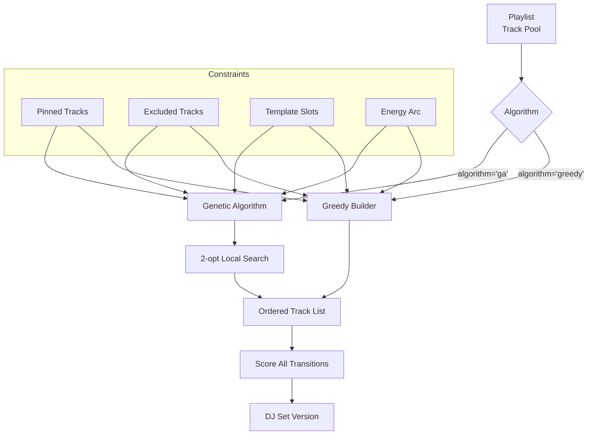
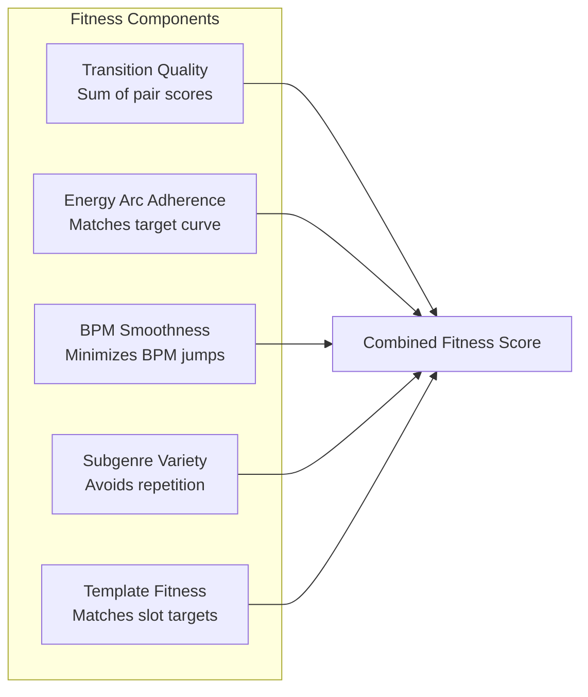
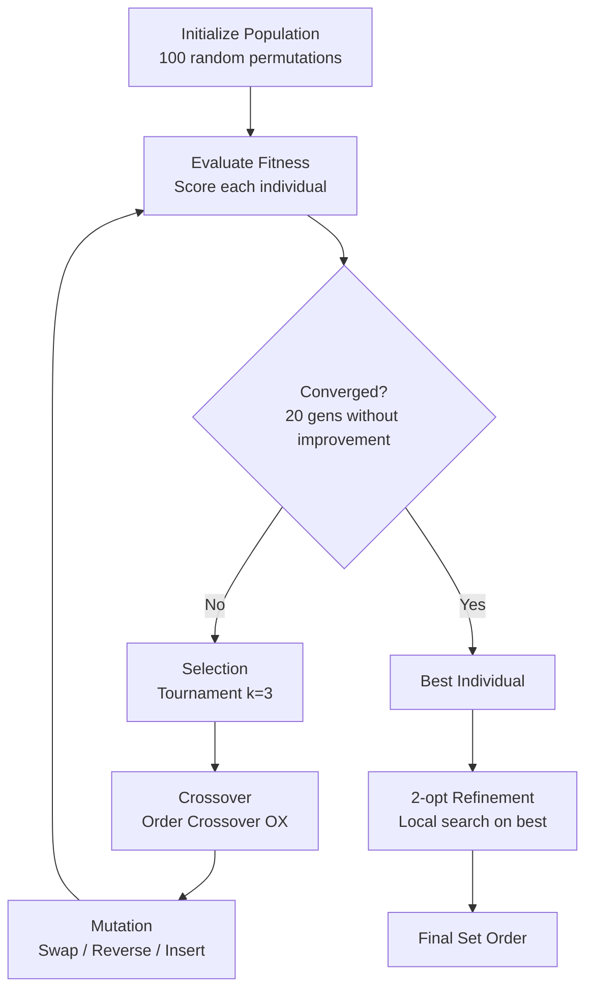
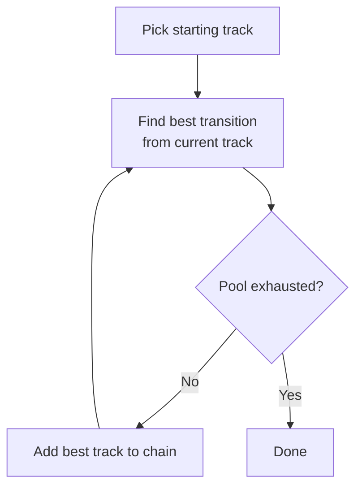
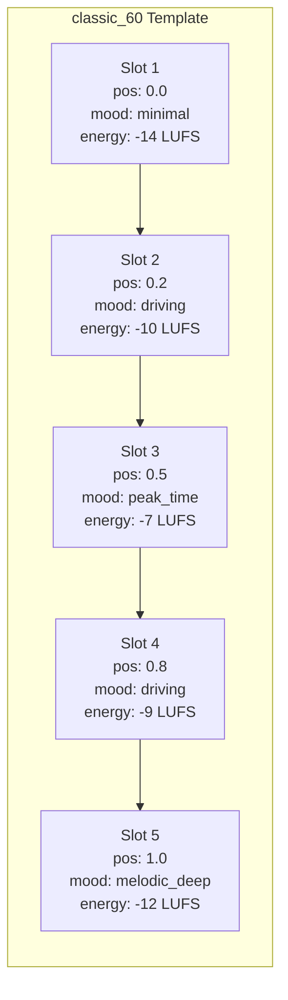

# DJ Set Generation

## Overview

DJ Music Plugin offers two algorithms for optimizing track order in a DJ set:

1. **Genetic Algorithm (GA)** -- Higher quality, slower (0.1s - 30s depending on track count)
2. **Greedy Chain Builder** -- Fast, acceptable quality (~10% worse than GA)

Both maximize transition quality scores while respecting constraints like energy arcs, BPM smoothness, and subgenre variety.



## Genetic Algorithm Optimizer

### Fitness Function

The GA maximizes a multi-objective fitness function:



### GA Parameters

| Parameter | Default | Config Key | Description |
|-----------|---------|-----------|-------------|
| Population size | 100 | `settings.ga_population_size` | Individuals per generation |
| Max generations | 200 | `settings.ga_max_generations` | Upper limit |
| Mutation rate | 0.15 | `settings.ga_mutation_rate` | Probability of mutation |
| Elitism rate | 0.05 | `settings.ga_elitism_rate` | Top individuals preserved |
| Tournament size | 3 | `settings.ga_tournament_size` | Selection pressure |
| Convergence threshold | 20 | `settings.ga_convergence_threshold` | Gens without improvement before stopping |

### GA Operations



| Operation | Time (12 tracks) | Description |
|-----------|-----------------|-------------|
| `init_population(100)` | 0.17 ms | 100 random shuffles |
| `eval_population(100)` | 3.32 ms | **91% of generation cost** |
| `compute_fitness(12t)` | 0.031 ms | 11 transitions x 5 components |
| `ox_crossover()` | 0.001 ms | Order-preserving crossover |
| `mutate()` | 0.0003 ms | Random swap/reverse/insert |
| `tournament_select()` | 0.001 ms | Pick best of 3 random |
| `two_opt(12t)` | 10.23 ms | O(n^2) per iteration |

### Pinned and Excluded Tracks

```python
# Pinned tracks stay in the set (GA cannot remove them)
rebuild_set(set_id=1, pin=[10, 20, 30], algorithm="ga")

# Excluded tracks are banned from the set
rebuild_set(set_id=1, exclude=[40, 50], algorithm="ga")

# Combine pinning and excluding
rebuild_set(
    set_id=1,
    pin=[10, 20],           # Keep these
    exclude=[40, 50],       # Remove these
    version_label="v2",
    algorithm="ga"
)
```

### 2-opt Local Search

Post-GA refinement that tries swapping adjacent pairs to find local improvements:

```
For each pair (i, j) in the set:
    Try reversing the segment between i and j
    If fitness improves: keep the swap
    Else: revert
```

**Warning:** 2-opt is O(n^2) per iteration and becomes the bottleneck for 200+ tracks. See [Performance](Performance#ga-optimizer-deep-profile) for details.

## Greedy Chain Builder

A fast alternative that builds a chain by greedily selecting the best next transition at each step:



**Pros:** Very fast (~8ms for 12 tracks), guaranteed completion
**Cons:** No global optimization, ~10% worse quality than GA, may paint itself into a corner

## Set Templates

8 pre-defined templates with slot-based energy arcs:

| Template | Duration | Energy Pattern | Description |
|----------|----------|---------------|-------------|
| `warm_up_30` | 30 min | Low, gradual rise | Low-energy opener |
| `classic_60` | 60 min | Build -> Peak -> Release | Standard DJ set structure |
| `peak_hour_60` | 60 min | High throughout | High-energy peak time |
| `roller_90` | 90 min | Sustained high | Driving energy sustained |
| `progressive_120` | 120 min | Very gradual build | 2-hour progressive journey |
| `wave_120` | 120 min | Multiple waves | Energy waves up and down |
| `closing_60` | 60 min | Gradual descent | Energy wind-down closer |
| `full_library` | variable | Auto-detect | Use all available tracks |

### Template Slots

Each template defines a sequence of slots:



Each slot specifies:
- **position** (0.0 - 1.0): Where in the set timeline
- **target_mood**: Expected subgenre
- **energy_target**: Target LUFS level
- **bpm_range**: Expected BPM min/max
- **target_duration**: Expected track duration at this position
- **flexibility**: How strictly to enforce slot requirements

### Template-Aware Fitness

When a template is active, the fitness function includes an additional component comparing each track's actual mood, energy, and BPM against its assigned template slot.

## Usage via MCP Tools

### Build a New Set

```python
# Quick build with greedy algorithm
build_set(
    playlist_id=1,
    name="Friday Night Techno",
    template="classic_60",
    algorithm="greedy"
)

# Quality build with GA
build_set(
    playlist_id=1,
    name="Friday Night Techno",
    template="peak_hour_60",
    algorithm="ga"
)

# Preview without saving
build_set(
    playlist_id=1,
    name="Test Set",
    algorithm="ga",
    dry_run=True
)
```

### Iterate on a Set

```python
# Review quality
quick_set_review(set_id=1)

# Identify weak transitions
explain_transition(from_track_id=10, to_track_id=20)

# Find replacements
find_replacement(set_id=1, position=5, count=5)

# Rebuild with modifications
rebuild_set(
    set_id=1,
    pin=[10, 20, 30],
    exclude=[40],
    algorithm="ga",
    version_label="improved_v2"
)

# Compare versions
compare_set_versions(set_id=1)
```

### Workflow Prompt

For guided set building, use the `build_set_workflow` prompt:

```
build_set_workflow(
    playlist_name="TECHNO FOR DJ SETS",
    template="classic_60",
    duration_min=60
)
```

This guides through 7 steps: Get playlist -> Audit -> Fill gaps -> Build -> Review -> Fix -> Deliver.

## Scaling Considerations

| Tracks | GA Time | 2-opt Time | Total | Status |
|-------:|--------:|----------:|---------:|--------|
| 12 | 3 ms/gen | 10 ms | 0.2s | OK |
| 50 | 13 ms/gen | 178 ms | 0.8s | OK |
| 100 | 26 ms/gen | 710 ms | 2.0s | OK |
| 200 | 52 ms/gen | 2.8s | 5.4s | Warning |
| 500 | 129 ms/gen | 17.8s | **24.1s** | Slow |

The bottleneck shifts from fitness evaluation (91% per generation) to 2-opt refinement (O(n^2)) as track count increases. See [Performance](Performance) for optimization recommendations.

## Related Pages

- **[Transition Scoring](Transition-Scoring)** -- Scoring formula used by both algorithms
- **[Audio Analysis Pipeline](Audio-Analysis-Pipeline)** -- Features that drive scoring
- **[MCP Tools Reference](MCP-Tools-Reference#set-building-4-tools)** -- Tool parameters
- **[Performance](Performance#ga-optimizer-deep-profile)** -- Detailed GA profiling
- **[E2E Pipeline](E2E-Pipeline)** -- Full pipeline including set building
