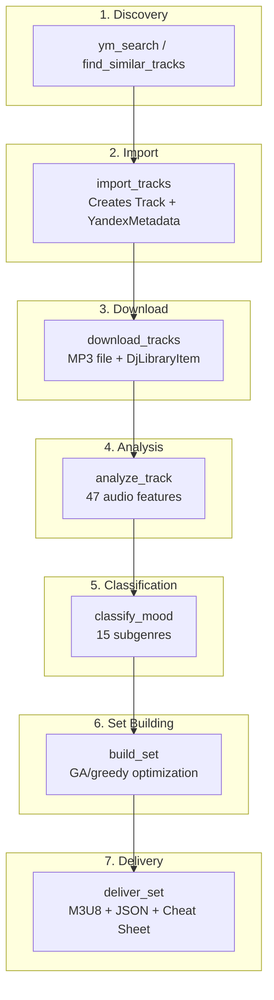
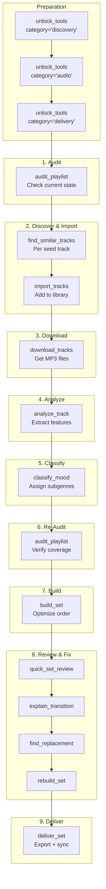
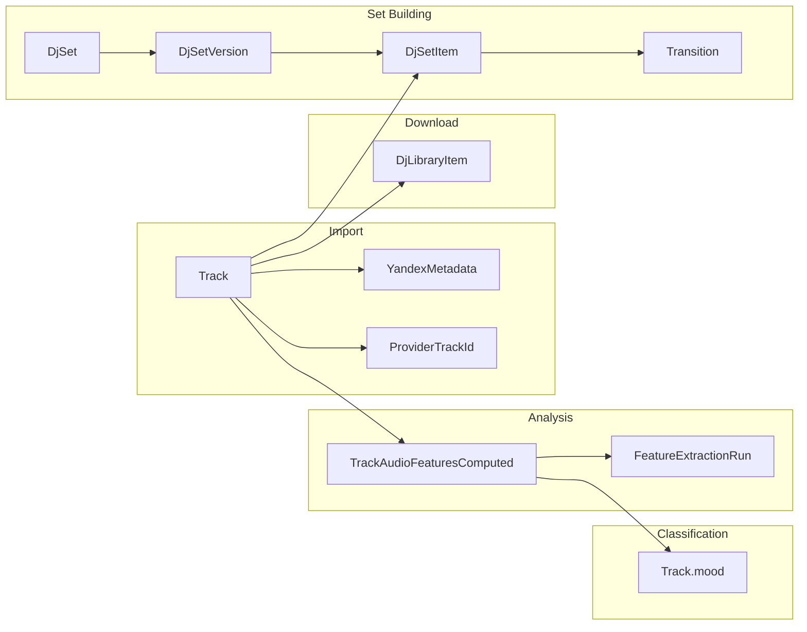

# E2E Pipeline

## Overview

The end-to-end pipeline takes tracks from discovery to a deliverable DJ set. Each stage builds on the previous one, with data flowing through the database.



## Stage Details

### Stage 1: Discovery

Find new tracks to add to the library.

**Tools:** `ym_search`, `find_similar_tracks`, `expand_playlist_ym`

```python
# Search by query
ym_search(query="dark minimal techno 135 BPM", type="tracks", limit=20)

# Find similar to an existing track (YM recommendations)
find_similar_tracks(track_id=42, strategy="ym", limit=20)

# LLM-assisted discovery (Claude generates queries)
find_similar_tracks(
    track_id=42,
    strategy="llm",
    search_queries=["Amelie Lens acid techno", "FJAAK industrial"]
)
```

**Output:** List of YM track IDs to import

### Stage 2: Import

Import discovered tracks into the local database.

**Tool:** `import_tracks`

```python
import_tracks(
    track_refs=["ym:12345", "ym:67890"],
    playlist_id=1,          # Optional: add to playlist
    auto_analyze=False      # Can trigger analysis automatically
)
```

**What happens:**
1. Creates `Track` record with title, duration, artists
2. Creates `YandexMetadata` record with album info, cover URI, etc.
3. Creates `ProviderTrackId` mapping (local_id <-> ym_id)
4. Optionally adds to a playlist

**Output:** Track records in database (no audio file yet)

### Stage 3: Download

Download MP3 files from Yandex Music to local storage.

**Tool:** `download_tracks`

```python
download_tracks(
    track_refs=["ym:12345", "ym:67890"],
    target_dir="/Users/you/Music/",  # Optional custom dir
    skip_existing=True
)
```

**What happens:**
1. Resolves YM download URL (two-step: download-info -> signed URL)
2. Downloads MP3 file to `DJ_YM_LIBRARY_PATH`
3. **Automatically creates `DjLibraryItem`** via `_link_file_to_track()`
4. Records file path, hash, size, MIME type, bitrate, sample rate

**Output:** MP3 files on disk + `DjLibraryItem` records in DB

> **Important:** `download_tracks` automatically creates library item records -- no need to manually link files to tracks. This means `analyze_track` can immediately find the audio file.

> **Tip:** For large batches (10+ tracks), split into groups of 5 to avoid UI timeouts. See [Known Issues](Known-Issues#bug-003).

### Stage 4: Audio Analysis

Extract 47 audio features from each track.

**Tool:** `analyze_track` (requires `unlock_tools(category="audio")`)

```python
# Single track
analyze_track(track_id=42)

# With specific analyzers only
analyze_track(track_id=42, analyzers=["bpm", "key", "energy"])

# Force re-analysis
analyze_track(track_id=42, force=True)
```

**What happens:**
1. Loads MP3 as mono float32 at 22050 Hz
2. Runs all available analyzers (7 if librosa installed, 3 otherwise)
3. Filters features through `TrackAudioFeaturesComputed.filter_features()`
4. Saves to `track_audio_features_computed` table
5. Creates `feature_extraction_runs` record

**Output:** 47 features per track in the database

**Performance:** ~21 seconds per track. See [Performance](Performance) for details.

### Stage 5: Mood Classification

Assign each track to one of 15 techno subgenres.

**Tool:** `classify_mood`

```python
# Classify specific tracks
classify_mood(track_ids=[42, 43, 44])

# Classify entire playlist
classify_mood(playlist_id=1)

# Reclassify (overwrite existing)
classify_mood(playlist_id=1, reclassify=True)
```

**What happens:**
1. Loads audio features from DB
2. Scores track against all 15 subgenre profiles
3. Applies catch-all penalty (0.85x) to `driving` and `hypnotic`
4. Winner = highest score; confidence = margin over second place
5. Saves mood assignment to track record

**Output:** mood, confidence, scores dict, reasoning per track

### Stage 6: Set Building

Build an optimized DJ set from a playlist.

**Tool:** `build_set`

```python
build_set(
    playlist_id=1,
    name="Friday Night Techno",
    template="classic_60",
    algorithm="ga"            # or "greedy" for speed
)
```

**What happens:**
1. Loads all tracks from playlist with their features
2. Pre-computes transition scores between candidate pairs
3. Runs optimization algorithm (GA or greedy)
4. Applies 2-opt local refinement (GA only)
5. Creates `DjSet`, `DjSetVersion`, `DjSetItem` records
6. Stores transition scores for each consecutive pair

**Output:** Ordered set with scored transitions

### Stage 7: Delivery

Export the finalized set for DJ performance.

**Tool:** `deliver_set` (requires `unlock_tools(category="delivery")`)

```python
deliver_set(
    set_id=1,
    copy_files=True,
    sync_to_ym=True,
    formats=["m3u8", "json_guide", "cheat_sheet"]
)
```

**What happens:**
1. **Score all transitions** -- evaluates every consecutive pair
2. **Handle conflicts** -- if hard conflicts exist (score=0.0), asks user via elicitation
3. **Write files** to `generated-sets/{set_name}/`:
   - Numbered MP3 copies: `01. Track Title.mp3`, `02. Track Title.mp3`, ...
   - Extended M3U8 with DJ tags (BPM, key, cue points, transitions)
   - JSON guide with per-track and per-transition details
   - Text cheat sheet with human-readable transition notes
4. **Handle iCloud stubs** -- skip copying if file not fully downloaded
5. **Optional YM sync** -- push as a Yandex Music playlist

**Output:** Export directory with MP3s, M3U8, JSON, cheat sheet

## Complete Pipeline Flow



## Workflow Prompts

Use pre-built prompts for guided execution:

### Full Expansion Pipeline

```python
# Prompt: full_expansion_pipeline
# 9 steps: Audit -> Discover -> Import -> Download -> Analyze -> Re-audit -> Classify -> Distribute -> Verify
full_expansion_pipeline(
    source_playlist="TECHNO FOR DJ SETS",
    target_per_subgenre=50
)
```

### Build Set Workflow

```python
# Prompt: build_set_workflow
# 7 steps: Get playlist -> Audit -> Fill gaps -> Build -> Review -> Fix -> Deliver
build_set_workflow(
    playlist_name="TECHNO FOR DJ SETS",
    template="classic_60",
    duration_min=60
)
```

### Deliver Set Workflow

```python
# Prompt: deliver_set_workflow
# 7 steps: Score -> Handle conflicts -> Export -> Copy -> Verify -> Cheat sheet -> YM sync
deliver_set_workflow(
    set_name="Friday Night Techno",
    sync_ym=True
)
```

## Data Flow Through the Database



## Subgenre Distribution Pipeline

A specialized pipeline for distributing tracks across 15 subgenre playlists:

```python
# 1. Classify all tracks in source playlist
classify_mood(playlist_id=source_id, reclassify=True)

# 2. Distribute to subgenre playlists + sync to YM
distribute_to_subgenres(
    source_playlist_id=source_id,
    mode="clean_rebuild",
    sync_to_ym=True
)

# 3. Verify distribution
get_library_stats()
```

15 Yandex Music playlists (one per subgenre) + 15 corresponding local DB playlists are maintained.

## Related Pages

- **[Getting Started](Getting-Started)** -- First run setup
- **[MCP Tools Reference](MCP-Tools-Reference)** -- All tool parameters
- **[Audio Analysis Pipeline](Audio-Analysis-Pipeline)** -- Stage 4 details
- **[Transition Scoring](Transition-Scoring)** -- Scoring used in stages 6-7
- **[DJ Set Generation](DJ-Set-Generation)** -- Stage 6 algorithms
- **[Yandex Music Integration](Yandex-Music-Integration)** -- Stages 1-3 API details
- **[Known Issues](Known-Issues)** -- Gotchas in the pipeline
