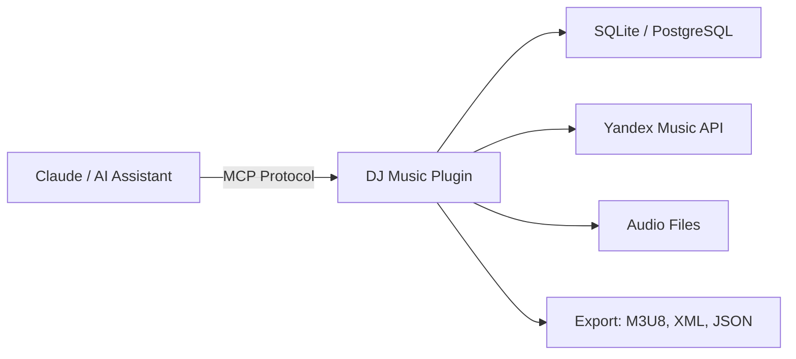
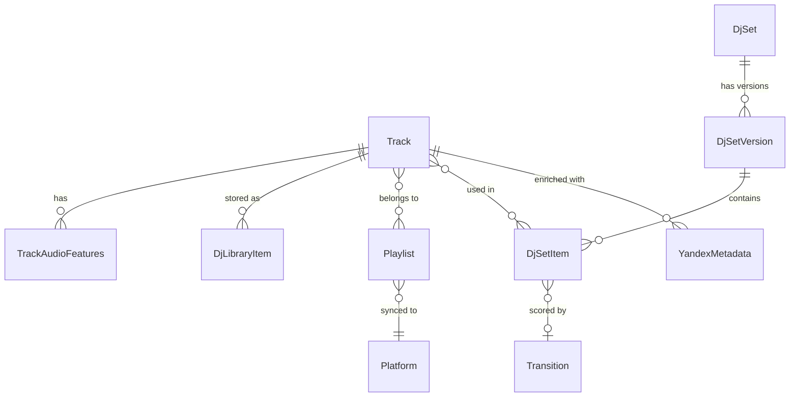

# DJ Music Plugin

> MCP server for managing a personal DJ techno music library, building optimized DJ sets, and integrating with Yandex Music.

**Version:** 0.4.0 | **Python:** 3.12+ | **Protocol:** MCP (Model Context Protocol) | **Framework:** FastMCP v3.1

---

## What is DJ Music Plugin?

DJ Music Plugin is a standalone MCP server that exposes **50 tools** for AI assistants (Claude, etc.) to manage a DJ techno music library end-to-end. There is no REST API, no CLI, no web UI -- MCP is the sole interface.



## Key Features

| Feature | Description |
|---------|-------------|
| **50 MCP Tools** | 12 categories: CRUD, search, set building, delivery, discovery, curation, sync, YM API, audio, admin |
| **Audio Analysis** | 7 analyzers extracting 47 features: BPM, key, loudness, energy, spectral, beat, MFCC |
| **Transition Scoring** | 5-component formula (BPM + harmonic + energy + spectral + groove) with hard constraints |
| **Set Generation** | Genetic algorithm optimizer + greedy chain builder with 8 DJ set templates |
| **Mood Classification** | Rule-based classifier for 15 techno subgenres (ambient_dub to hard_techno) |
| **Yandex Music** | Full integration: search, import, download MP3, playlist sync, recommendations |
| **Export** | Extended M3U8 with DJ tags, Rekordbox XML, JSON guide, text cheat sheet |
| **Background Tasks** | Long-running operations via FastMCP Docket (expand, analyze, deliver) |

## Quick Navigation

### Getting Started
- **[Getting Started](Getting-Started)** -- Installation, configuration, first run

### Core Concepts
- **[Architecture](Architecture)** -- Layer diagram, data flow, dependency injection
- **[MCP Tools Reference](MCP-Tools-Reference)** -- All 50 tools with parameters and examples
- **[Configuration Reference](Configuration-Reference)** -- All settings with defaults

### Domain
- **[Audio Analysis Pipeline](Audio-Analysis-Pipeline)** -- 7 analyzers, mood classifier, 15 subgenres
- **[Transition Scoring](Transition-Scoring)** -- 5-component formula, Camelot wheel, hard constraints
- **[DJ Set Generation](DJ-Set-Generation)** -- GA optimizer, greedy builder, templates

### Integration
- **[Yandex Music Integration](Yandex-Music-Integration)** -- API client, rate limiting, quirks
- **[E2E Pipeline](E2E-Pipeline)** -- Import, download, analyze, classify, build set flow

### Operations
- **[Performance](Performance)** -- Benchmark results, bottleneck analysis, GA profiling
- **[Known Issues](Known-Issues)** -- Documented bugs with root cause analysis
- **[Contributing](Contributing)** -- Code style, testing, commit conventions

## Domain at a Glance



### Data Volumes (Reference)

| Entity | Approximate Count |
|--------|------------------|
| Tracks | ~3,000 |
| Audio Features | ~2,800 |
| Track Sections | ~108,000 |
| Library Items (files) | ~2,750 |
| Playlists | ~25 |
| DJ Sets | ~43 |
| Set Versions | ~55 |

## 15 Techno Subgenres

Ordered by energy intensity (low to high):

```
ambient_dub > dub_techno > minimal > detroit > melodic_deep >
progressive > hypnotic > driving > tribal > breakbeat >
peak_time > acid > raw > industrial > hard_techno
```

## Technology Stack

| Component | Technology |
|-----------|-----------|
| Server | FastMCP v3.1 with FileSystemProvider |
| Database | SQLAlchemy 2.0 async (SQLite dev / PostgreSQL prod) |
| HTTP Client | httpx (async, for Yandex Music API) |
| Audio | numpy (core), librosa (optional), demucs (optional) |
| Validation | Pydantic v2 |
| Type Checking | mypy strict + pydantic plugin |
| Linting | ruff |
| Testing | pytest + pytest-asyncio |
| Migrations | Alembic |
| Package Manager | uv |
