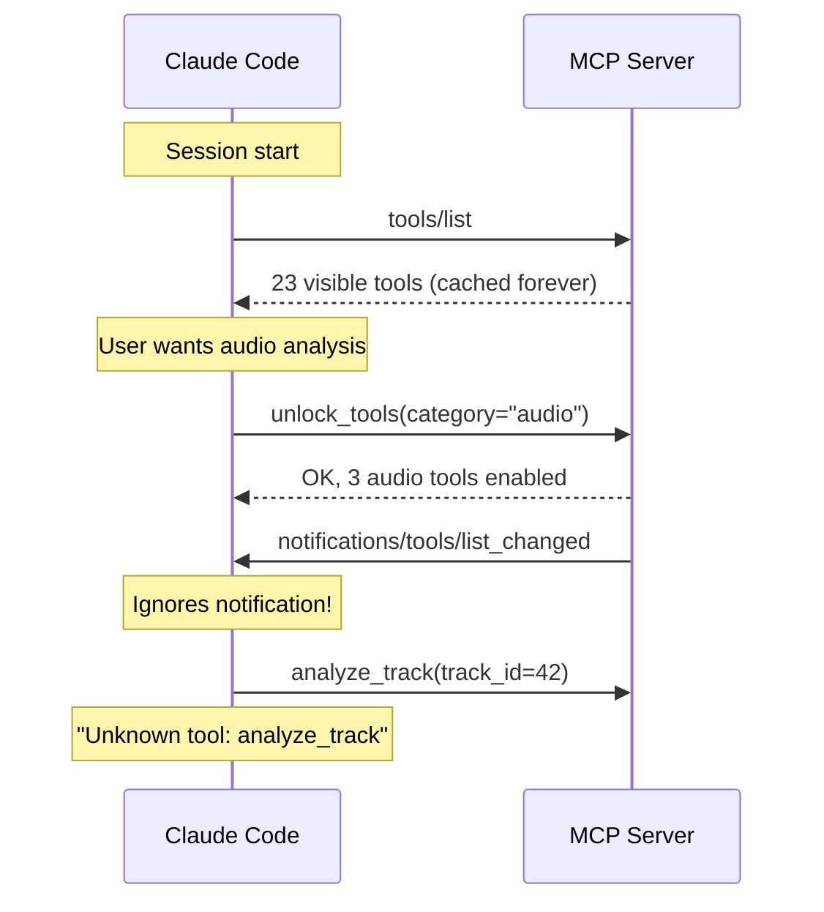
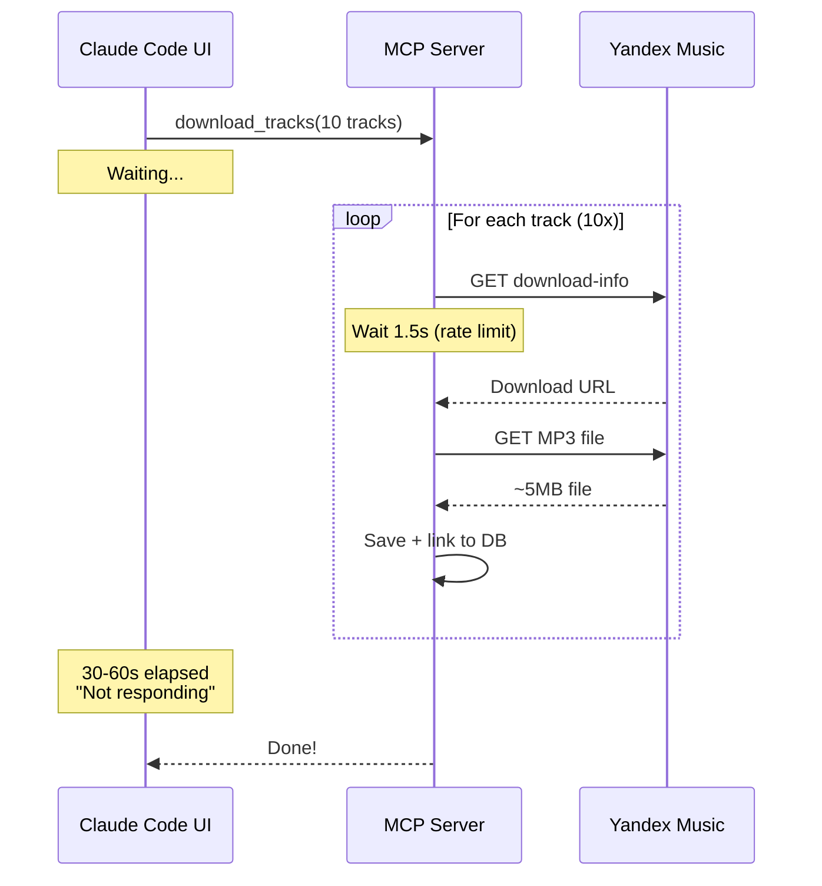

# Known Issues

Documented bugs with root cause analysis and workarounds.

## BUG-001: Hidden Tools Not Accessible After `unlock_tools`

**Status:** Open (upstream limitation)
**Date:** 2026-03-25
**Severity:** Medium

### Problem

`unlock_tools(category="audio")` successfully unlocks tools on the MCP server side, but Claude Code's tool list is cached at session start and never refreshed. Hidden tools remain inaccessible.

### Root Cause



Claude Code calls `tools/list` once at session start and caches the result. FastMCP sends `notifications/tools/list_changed` when tools are enabled/disabled, but **Claude Code does not re-fetch the tool list** in response.

### Affected Tools

| Tool | Category |
|------|----------|
| `analyze_track` | audio |
| `analyze_batch` | audio |
| `separate_stems` | audio |
| `analyze_one_track` | atomic |
| `classify_one_track` | atomic |
| `gate_one_track` | atomic |
| `get_similar_one_track` | atomic |

### Impact

- Cannot call hidden tools directly from Claude Code
- Affects the E2E pipeline: download -> **analyze** -> classify -> build set

### Workaround

Use a Python script via the Bash tool that creates a direct MCP client:

```python
# Bypasses Claude Code's cached tool list
from fastmcp import Client
async with Client(mcp) as client:
    result = await client.call_tool("analyze_track", {"track_id": 42})
```

### Possible Fixes

| # | Fix | Tradeoff |
|---|-----|---------|
| 1 | Make audio tools visible by default | Adds ~3 tools to schema |
| 2 | Move to "extended" tier (not hidden) | Still needs unlock |
| 3 | Wait for Claude Code to support `list_changed` | Upstream dependency |
| 4 | **Visible composite wrapper** (`manage_audio`) | Recommended: follows existing pattern |

**Recommendation:** Option 4 -- add a visible composite tool `manage_audio` with an `action` parameter, similar to `manage_tracks`/`manage_playlist` pattern.

---

## BUG-002: Pipeline Features Mismatch DB Model

**Status:** Fixed
**Date:** 2026-03-25
**Severity:** High (was causing crashes)

### Problem

`AnalysisPipeline.analyze()` returned feature dicts with keys that don't exist as columns in `TrackAudioFeaturesComputed`. When passed via `**result.features`, SQLAlchemy raised `TypeError: 'X' is an invalid keyword argument`.

### Root Cause

Pipeline analyzers used different naming conventions than the DB model:

| Pipeline Key | DB Column | Status |
|-------------|-----------|--------|
| `energy_band_sub` | `energy_sub` | Fixed: renamed in analyzer |
| `energy_band_low` | `energy_low` | Fixed: renamed |
| `energy_band_low_mid` | `energy_lowmid` | Fixed: renamed |
| `energy_band_mid` | `energy_mid` | Fixed: renamed |
| `energy_band_high_mid` | `energy_highmid` | Fixed: renamed |
| `energy_band_high` | `energy_high` | Fixed: renamed |
| `energy_band_brilliance` | (none) | Fixed: removed |
| `mfcc_mean` | (none) | Fixed: filtered |
| `chroma_vector` | (none) | Fixed: filtered |

### Fix Applied

1. **EnergyAnalyzer** -- renamed bands: `energy_band_{name}` -> `energy_{name}`; removed `brilliance` band
2. **MoodClassifier** -- updated all `energy_band_*` references to `energy_*`
3. **Feature filter** -- added `TrackAudioFeaturesComputed.filter_features(dict)` classmethod that filters pipeline output to only valid DB columns
4. **Applied filter** in both save locations: `audio_service.py` and `audio_atomic.py`

### Prevention

Always use `filter_features()` when saving pipeline results:

```python
# Safe: filters out unknown keys
filtered = TrackAudioFeaturesComputed.filter_features(result.features)
features_record = TrackAudioFeaturesComputed(**filtered)

# Unsafe: may crash if pipeline adds new features
features_record = TrackAudioFeaturesComputed(**result.features)  # DON'T DO THIS
```

### Column Name Reference

Energy band columns use this naming convention:
- `energy_sub` (NOT `energy_band_sub`)
- `energy_lowmid` (NOT `energy_low_mid` or `energy_band_low_mid`)
- `energy_highmid` (NOT `energy_high_mid` or `energy_band_high_mid`)

---

## BUG-003: `download_tracks` "Not Responding" in UI

**Status:** Mitigated (upstream limitation)
**Date:** 2026-03-25
**Severity:** Low (cosmetic, not data loss)

### Problem

`download_tracks` with 10+ tracks takes 30-60 seconds. During this time, Claude Code UI shows "Not responding - try stopping" because the tool blocks the main conversation loop.

### Root Cause



The tool has `task=True` (enabling background execution for supporting clients), but Claude Code does not support MCP background task polling -- it waits synchronously for the tool result.

### Fix Applied

- Added `task=True` to `download_tracks` decorator
- Added `ctx.report_progress(i, total)` for progress updates
- Added DB session for automatic library item linking

### Remaining Issue

`task=True` enables background execution for clients that support it (FastMCP Client), but Claude Code does not poll tasks. The "Not responding" is a **Claude Code UI limitation**, not a server bug.

### Workaround

Split large batches into smaller calls (5 tracks each) to keep individual tool calls under 15 seconds:

```python
# Instead of:
download_tracks(track_refs=["ym:1", "ym:2", ..., "ym:20"])  # 60s, "Not responding"

# Do:
download_tracks(track_refs=["ym:1", "ym:2", "ym:3", "ym:4", "ym:5"])  # ~15s
download_tracks(track_refs=["ym:6", "ym:7", "ym:8", "ym:9", "ym:10"])  # ~15s
# ... etc
```

---

## Quick Reference

| Bug | Status | Severity | Workaround Available |
|-----|--------|----------|---------------------|
| BUG-001: Hidden tools inaccessible | Open | Medium | Python script via Bash |
| BUG-002: Pipeline feature mismatch | **Fixed** | High | `filter_features()` |
| BUG-003: Download "Not responding" | Mitigated | Low | Split into batches of 5 |

## Related Pages

- **[Architecture](Architecture)** -- Visibility system design
- **[Audio Analysis Pipeline](Audio-Analysis-Pipeline)** -- Pipeline and feature model
- **[E2E Pipeline](E2E-Pipeline)** -- How bugs affect the full workflow
- **[Performance](Performance)** -- Timing data for download operations
