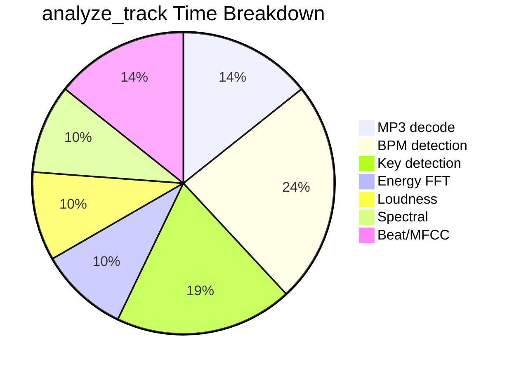
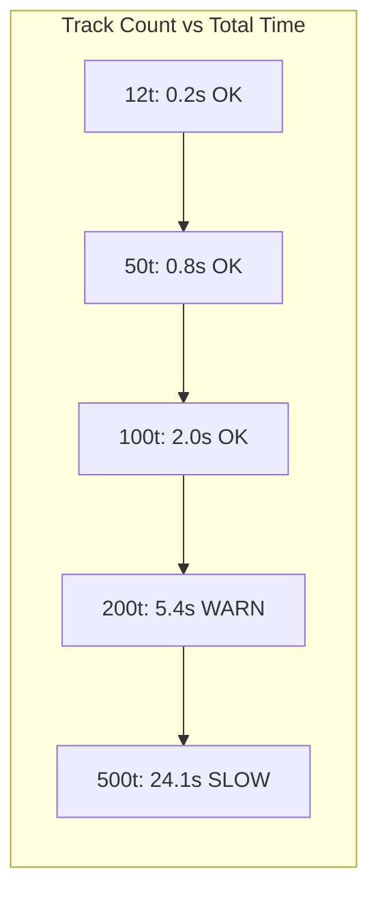

# Performance

Benchmark data collected on macOS ARM with SQLite (39 tracks, 10 with features).

## Summary

| Category | Time Range | Verdict |
|----------|-----------|---------|
| CRUD / Read / Search / Reasoning | 1-37 ms | No optimization needed |
| Set building (greedy) | 8-27 ms | Fast |
| Set building (GA, 12 tracks) | 131-199 ms | OK |
| Audio analysis (per track) | **20.9 s** | **Critical bottleneck** |
| YM API calls | 1.4-1.6 s | Rate limiter overhead |

## Light Operations (< 50ms)

All 35 CRUD/read/search/reasoning tools complete under 37ms:

| Operation | Time (ms) | Notes |
|-----------|----------:|-------|
| `list_tracks(3)` | 36 | First call, session warmup |
| `compare_set_versions` | 33 | Error path (1 version only) |
| `export_set(m3u8)` | 17 | File write |
| `distribute(dry)` | 16 | 47 tracks |
| `export_set(json)` | 15 | |
| `list_sets` | 13 | |
| `list_tracks(20)` | 11 | |
| `score_transitions(set)` | 9 | 9 transitions |
| `audit_playlist` | 9 | |
| `build_set(greedy, dry)` | 8 | |
| `get_track(query)` | 8 | ILIKE search |
| `quick_set_review` | 6 | |
| `get_library_stats` | 5 | Multiple COUNT queries |
| `classify_mood(10)` | 5 | Rule-based, no I/O |
| `resource:library` | 5 | |
| All other reads | 1-4 | |

**Verdict:** Local DB operations are fast. No optimization needed.

## Heavy Operations

| Operation | Time (ms) | Time (s) | Bottleneck |
|-----------|----------:|---------:|------------|
| **analyze_track (force)** | **20,906** | **20.9** | **Audio I/O + numpy FFT** |
| ym_get_tracks(1) | 1,580 | 1.6 | YM API latency + rate limit |
| ym_artist_tracks | 1,514 | 1.5 | YM API |
| ym_search | 1,361 | 1.4 | YM API |
| find_similar(ym) | 344 | 0.3 | YM API (cached?) |
| build_set(ga, dry) | 131 | 0.1 | GA optimizer |
| build_set(greedy, real) | 27 | 0.0 | |
| deliver_set(dry) | 25 | 0.0 | |

## Bottleneck Analysis

### 1. analyze_track: 21 Seconds (CRITICAL)



| Phase | Estimated Time | Library |
|-------|---------------|---------|
| MP3 decode | ~3s | librosa.load (22050Hz mono) |
| BPM detection | ~5s | librosa.beat.beat_track |
| Key detection | ~4s | chroma CQT + template matching |
| Energy FFT | ~2s | numpy rfft on full signal |
| Loudness | ~2s | LUFS computation |
| Spectral | ~2s | centroid, rolloff, flux |
| Beat/MFCC | ~3s | librosa onset, MFCC |

#### Optimization Recommendations

| # | Optimization | Expected Impact | Effort |
|---|-------------|----------------|--------|
| 1 | **60s chunk analysis** | 21s -> ~5s (3x speedup) | Medium |
| 2 | **Parallel analyzers** (asyncio.gather) | ~30% speedup | Medium |
| 3 | **Skip librosa for core** | 21s -> ~6s (core only) | Low |
| 4 | **Lower sample rate** (11025 Hz for energy/spectral) | ~20% speedup | Low |
| 5 | Audio signal already cached and shared | Already implemented | Done |

### 2. YM API Calls: 1.4-1.6s Each

The rate limiter adds 1.5s delay between calls (`settings.ym_rate_limit_delay`).

| # | Optimization | Expected Impact | Effort |
|---|-------------|----------------|--------|
| 1 | **Batch endpoints** | 1.5s/call -> 0.3s/batch | Low |
| 2 | **Cache YM search** (LRU, 5min TTL) | Repeat: 1.4s -> 0ms | Low |
| 3 | **Reduce rate limit** (0.5s) | Risk: more 429 errors | Low |
| 4 | **Prefetch metadata** during import | Amortized | Medium |

### 3. GA Optimizer: 131ms (OK for Small Sets)

With larger datasets this scales significantly. See GA deep profile below.

## GA Optimizer Deep Profile

**Test conditions:** 12 tracks, pop=100, max_gens=200, mut=0.15, conv_threshold=20

### Atomic Operation Costs

| Operation | Time | Notes |
|-----------|-----:|-------|
| `transition.score()` | 0.003 ms | Pure math, very fast |
| `compute_fitness(12t)` | 0.031 ms | 11 transitions x 5 components |
| `ox_crossover()` | 0.001 ms | Order-preserving crossover |
| `mutate()` | 0.0003 ms | Random swap/reverse/insert |
| `tournament_select()` | 0.001 ms | Best of 3 random |
| `init_population(100)` | 0.17 ms | 100 random shuffles |
| `eval_population(100)` | 3.32 ms | **91% of generation cost** |
| `two_opt(12t)` | 10.23 ms | O(n^2) per iteration |

### GA Run Results

| Metric | Value |
|--------|-------|
| Total time | **199 ms** |
| Generations run | 49 / 200 (converged at 20 stagnant) |
| Avg per generation | 4.0 ms |
| Score (GA) | **0.681** |
| Score (Greedy) | 0.621 |
| GA improvement | **+9.7%** over greedy |

### Cost Breakdown Per Generation

```
Fitness evaluation:  3.1 ms  (100 x 0.031)  <- 91% of cost
Genetic operators:   0.3 ms  (100 x 0.003)
----------------------------------------------
Total per gen:       3.4 ms
2-opt (post-GA):    10.2 ms  (one-time)
```

**Bottleneck:** Fitness evaluation (91%). Each individual requires n-1 transition scores.

### Scaling Projections



| Tracks | Per-Gen | 2-opt | Total (49 gens) | Status |
|-------:|--------:|------:|-----------------:|--------|
| 12 | 3 ms | 10 ms | 0.2s | OK |
| 20 | 5 ms | 28 ms | 0.3s | OK |
| 50 | 13 ms | 178 ms | 0.8s | OK |
| 100 | 26 ms | 710 ms | 2.0s | OK |
| 200 | 52 ms | 2,841 ms | 5.4s | Warning |
| 500 | 129 ms | 17,753 ms | **24.1s** | **SLOW** |

### GA Optimization Recommendations

| # | Optimization | Expected Impact | Effort |
|---|-------------|----------------|--------|
| 1 | **Limit 2-opt passes** (max_2opt_passes=3) | O(n^2) bounded | Low |
| 2 | **Skip 2-opt for n>100** | Eliminates scaling bottleneck | Low |
| 3 | **Fitness caching** (LRU by tuple(order)) | Avoid re-scoring same individuals | Low |
| 4 | **Parallel fitness eval** (ProcessPoolExecutor) | Linear speedup with cores | Medium |
| 5 | **Adaptive population** (50 for <50t, 100 for <200t, 200 for 200+) | Balance quality vs speed | Low |
| 6 | **Target worst-scoring 2-opt** | Only try swaps on weak transitions | Medium |

Early termination is already effective: 49/200 gens used (75% savings).

## Bugs Found During Benchmarking

1. `ym_artist_tracks` expects `artist_id: str`, but int was passed -> `ValidationError`
2. `compare_set_versions` fails with "Need at least 2 versions" (expected, set has 1 version)

## Related Pages

- **[Audio Analysis Pipeline](Audio-Analysis-Pipeline)** -- Analysis details
- **[DJ Set Generation](DJ-Set-Generation)** -- GA algorithm details
- **[Transition Scoring](Transition-Scoring)** -- Scoring formula
- **[Configuration Reference](Configuration-Reference)** -- Performance-related settings
- **[Known Issues](Known-Issues)** -- Related bugs
