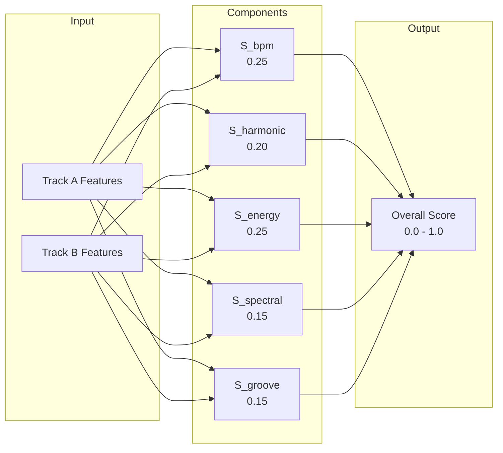
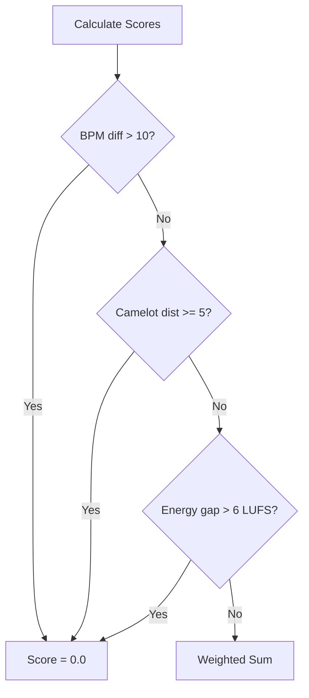

# Transition Scoring

## Overview

Transition scoring evaluates how well two tracks mix together using a 5-component weighted formula. Scores range from 0.0 (incompatible) to 1.0 (perfect match).



## Formula

```
score = w_bpm * S_bpm + w_harmonic * S_harmonic + w_energy * S_energy
      + w_spectral * S_spectral + w_groove * S_groove
```

### Default Weights

| Component | Weight | Purpose |
|-----------|--------|---------|
| **BPM** | 0.25 | Tempo compatibility |
| **Harmonic** | 0.20 | Key compatibility (Camelot wheel) |
| **Energy** | 0.25 | Energy flow (LUFS difference) |
| **Spectral** | 0.15 | Timbral similarity |
| **Groove** | 0.15 | Rhythmic compatibility |

Weights are defined in `app/core/constants.py` as `DEFAULT_TRANSITION_WEIGHTS` and can be overridden per template.

## Hard Constraints

If **any** of these are violated, the score is immediately 0.0 (hard reject):

| Constraint | Threshold | Config Key |
|-----------|-----------|-----------|
| BPM difference > N | **10 BPM** | `settings.transition_hard_reject_bpm_diff` |
| Camelot distance >= N | **5** | `settings.transition_hard_reject_camelot_dist` |
| Energy gap > N LUFS | **6.0 LUFS** | `settings.transition_hard_reject_energy_gap` |



## Component Details

### S_bpm -- Tempo Compatibility

Gaussian similarity with double/half-time awareness:

```
delta = |bpm_a - bpm_b|
# Check double/half-time (e.g., 130 BPM mixes with 65 BPM)
delta = min(delta, |bpm_a - bpm_b*2|, |bpm_a - bpm_b/2|)
S_bpm = exp(-delta^2 / (2 * sigma^2))   # sigma tuned for ~3 BPM tolerance
```

**Examples:**
- Same BPM (130 vs 130) -> 1.0
- Close (130 vs 132) -> ~0.95
- Moderate (130 vs 136) -> ~0.7
- Half-time (130 vs 65) -> ~0.95

### S_harmonic -- Key Compatibility

Based on Camelot wheel distance, weighted by chroma quality:

```
dist = camelot_distance(key_a, key_b)  # 0-6
base = {0: 1.0, 1: 0.9, 2: 0.6, 3: 0.3, 4: 0.1, 5+: 0.0}[dist]
S_harmonic = base * (1 - chroma_entropy_a/max) * sqrt(hnr_a * hnr_b)
```

### S_energy -- Energy Flow

Sigmoid function on LUFS difference with slight preference for energy increase:

```
delta = lufs_b - lufs_a  # positive = energy goes up
S_energy = sigmoid(delta, center=0, spread=3)
```

### S_spectral -- Timbral Similarity

Three sub-components combined:

```
mfcc_sim     = cosine_similarity(mfcc_a, mfcc_b)         # 40%
centroid_sim = 1 - |centroid_a - centroid_b| / max        # 30%
band_balance = correlation(energy_bands_a, energy_bands_b) # 30%
S_spectral   = 0.4 * mfcc_sim + 0.3 * centroid_sim + 0.3 * band_balance
```

### S_groove -- Rhythmic Compatibility

```
onset_match = 1 - |onset_rate_a - onset_rate_b| / max(onset_rate_a, onset_rate_b)
kick_match  = 1 - |kick_prominence_a - kick_prominence_b|
S_groove    = 0.5 * onset_match + 0.5 * kick_match
```

## Camelot Wheel

24 musical keys arranged in a circle where adjacent keys are harmonically compatible.

```
        12B(E)
    11B(A)   1B(B)
  10B(D)       2B(F#)
 9B(G)           3B(Db)
  8B(C)        4B(Ab)
    7B(F)    5B(Eb)
        6B(Bb)

        12A(Dbm)
    11A(F#m)   1A(Abm)
  10A(Bm)        2A(Ebm)
 9A(Em)            3A(Bbm)
  8A(Am)         4A(Fm)
    7A(Dm)     5A(Cm)
        6A(Gm)
```

### Compatible Transitions (Distance <= 1)

| Transition Type | Example | Distance |
|----------------|---------|----------|
| Same key | 8A -> 8A | 0 |
| Adjacent key (up) | 8A -> 9A | 1 |
| Adjacent key (down) | 8A -> 7A | 1 |
| Relative major/minor | 8A -> 8B | 1 |

### Key Code Reference

All 24 keys with Camelot notation:

| Code | Camelot | Key Name | Code | Camelot | Key Name |
|------|---------|----------|------|---------|----------|
| 0 | 1A | Ab minor | 1 | 1B | B major |
| 2 | 2A | Eb minor | 3 | 2B | F# major |
| 4 | 3A | Bb minor | 5 | 3B | Db major |
| 6 | 4A | F minor | 7 | 4B | Ab major |
| 8 | 5A | C minor | 9 | 5B | Eb major |
| 10 | 6A | G minor | 11 | 6B | Bb major |
| 12 | 7A | D minor | 13 | 7B | F major |
| 14 | 8A | A minor | 15 | 8B | C major |
| 16 | 9A | E minor | 17 | 9B | G major |
| 18 | 10A | B minor | 19 | 10B | D major |
| 20 | 11A | F# minor | 21 | 11B | A major |
| 22 | 12A | Db minor | 23 | 12B | E major |

## Feature Loading

Features are loaded via `TrackFeatures.from_db()` classmethod -- the single source of truth for DB-to-dataclass mapping:

```python
# Single track
feat = await feat_repo.get_scoring_features(track_id)

# Batch (1 SQL query instead of N)
features_map = await feat_repo.get_scoring_features_batch(track_ids)
feat = features_map.get(tid, TrackFeatures())  # default empty if no features
```

> **Important:** Always use `from_db()` classmethod or repository methods. Never manually copy fields from DB rows.

## Transition Cache

LRU cache for computed transition scores:

| Property | Value | Config Key |
|----------|-------|-----------|
| Key format | `(track_id_a, track_id_b)` ordered tuple | -- |
| TTL | 3600s (1 hour) | `settings.transition_cache_ttl` |
| Max size | 10,000 entries | `settings.transition_cache_max_size` |
| Invalidation | When audio features of either track change | -- |

## Pair Pruning

For 3,000 tracks, naive O(n^2) = 9M pairs. Pruning reduces this significantly:


| Filter | Reduction | Remaining |
|--------|-----------|-----------|
| BPM index (+-10 BPM) | ~30% of library | 2.7M |
| Key index (compatible Camelot) | ~40% | 1.08M |
| Energy filter (+-6 LUFS) | ~50% | **540K pairs** |

## Usage via MCP Tools

```python
# Score all transitions in a set
score_transitions(mode="set", set_id=42)

# Score a specific pair
score_transitions(mode="pair", from_track_id=10, to_track_id=20)

# Find best transition candidates for a track
score_transitions(mode="track_candidates", from_track_id=10, top_n=10)

# Detailed explanation of a transition
explain_transition(from_track_id=10, to_track_id=20)
```

## Related Pages

- **[Audio Analysis Pipeline](Audio-Analysis-Pipeline)** -- How features are extracted
- **[DJ Set Generation](DJ-Set-Generation)** -- How scores drive optimization
- **[MCP Tools Reference](MCP-Tools-Reference#set-building-4-tools)** -- Score tools parameters
- **[Configuration Reference](Configuration-Reference)** -- Scoring thresholds
