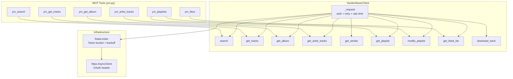
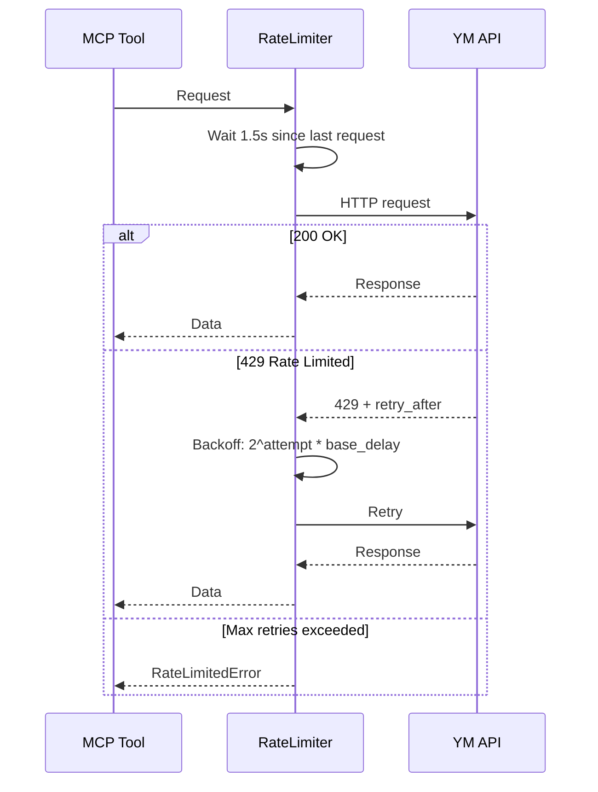
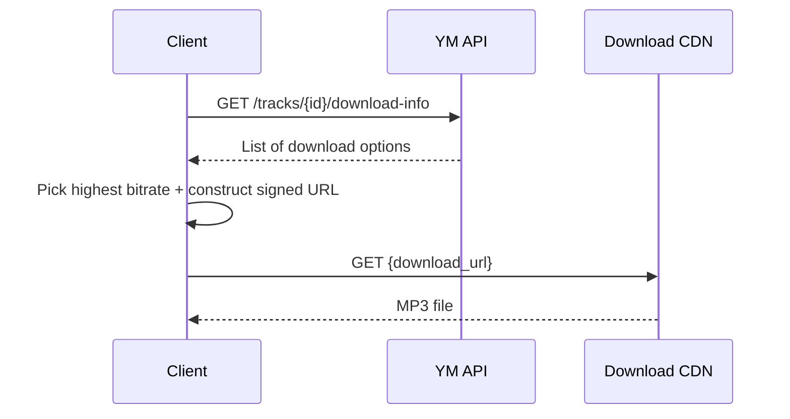

# Yandex Music Integration

## Overview

The plugin integrates with the Yandex Music REST API via an async HTTP client (`httpx`) with rate limiting, retry logic, and proper error handling.



## Authentication

```
Authorization: OAuth {settings.ym_token}
```

The token is obtained from Yandex OAuth and is long-lived (no refresh mechanism in the API). Configure via `DJ_YM_TOKEN` environment variable.

## Rate Limiting

YM API rate-limits aggressively on **both reads and writes** (HTTP 429):



| Setting | Default | Config Key |
|---------|---------|-----------|
| Delay between requests | 1.5s | `settings.ym_rate_limit_delay` |
| Max retry attempts | 3 | `settings.ym_retry_attempts` |
| Backoff multiplier | 2.0x | `settings.ym_retry_backoff_factor` |

## API Operations

### Search

```python
ym_search(query="Amelie Lens techno", type="tracks", limit=10)
```

| Type | Description |
|------|-------------|
| `tracks` | Search tracks (default) |
| `albums` | Search albums |
| `artists` | Search artists |
| `playlists` | Search playlists |
| `all` | Search all types |

> **Gotcha:** Use `type="tracks"` (plural), NOT `type="track"`.

### Tracks

```python
# Batch fetch (up to 100 per request)
ym_get_tracks(track_ids=["12345", "67890"])
```

### Albums

```python
ym_get_album(album_id="123456", include_tracks=True)
```

### Artists

```python
# Paginated artist tracks
ym_artist_tracks(artist_id="12345", page=0, sort_by="date")
```

> **Gotcha:** `artist_id` must be a **string**, not an integer.

### Playlists (Consolidated Tool)

```python
# List user playlists
ym_playlists(action="list")

# Get specific playlist
ym_playlists(action="get", playlist_id="1234")

# Create playlist
ym_playlists(action="create", name="My Set", visibility="private")

# Add tracks
ym_playlists(action="add_tracks", playlist_id="1234", track_ids=["111:222", "333:444"])

# Remove tracks
ym_playlists(action="remove_tracks", playlist_id="1234", positions=[0, 1, 2])
```

### Likes

```python
# Get liked track IDs
ym_likes(action="get_liked")

# Like tracks
ym_likes(action="add", track_ids=["12345", "67890"])

# Unlike tracks
ym_likes(action="remove", track_ids=["12345"])
```

## Known API Quirks

### Playlist Modifications Use JSON Diff Format

YM expects changes as a diff array, **not** a simple track list:

```json
// Adding tracks: POST /users/{uid}/playlists/{kind}/change-relative
{
  "diff": [
    {"op": "insert", "at": 0, "tracks": [
      {"id": "12345", "albumId": "6789"}
    ]}
  ]
}
```

> **Gotcha:** Track format for add_tracks is `"trackId:albumId"` -- the `albumId` is **required**.

### Delete Uses Inclusive/Exclusive Index Ranges

```json
// Removing track at position 3:
{"diff": [{"op": "delete", "from": 3, "to": 4}]}
// from = inclusive, to = exclusive
```

### Always Re-Fetch After Modification

Playlist `revision` changes on every edit. Always re-fetch after modifying:

```python
await client.modify_playlist(playlist_id, diff)
updated = await client.get_playlist(playlist_id)  # fresh revision
```

### Download URL Resolution (Two-Step)



### Broken Endpoints

| Endpoint | Error | Workaround |
|----------|-------|------------|
| Artist brief-info | 403 Antirobot | Use artist tracks/albums instead |
| Lyrics | 400 requires HMAC | Skip lyrics feature |

### Batch Operations

Many endpoints accept batch IDs for efficiency:

| Endpoint | Format | Max |
|----------|--------|-----|
| `GET /tracks` | `?trackIds=1,2,3` | 100 per request |
| `POST /playlists/list` | `{"playlistIds": [...]}` | -- |
| `POST /albums` | `{"albumIds": [...]}` | -- |

## Error Handling

| HTTP Status | Error Type | Action |
|-------------|-----------|--------|
| 200 | -- | Parse response |
| 400 | `APIError` | Log body, raise |
| 401 | `AuthFailedError` | "Check DJ_YM_TOKEN" |
| 403 | `AuthFailedError` or `APIError` | May be Antirobot |
| 429 | `RateLimitedError` | Retry with backoff |
| 500+ | `APIError` | Retry up to max_attempts |

## Data Model Mapping

YM responses are mapped to local models:

| YM Field | Local Field | Notes |
|----------|-------------|-------|
| `id` | `yandex_track_id` | String in YM, stored as string |
| `albums[0]` | `YandexMetadata.album_*` | Track can have multiple albums |
| `durationMs` | `Track.duration_ms` | Direct mapping |
| `coverUri` | `YandexMetadata.cover_uri` | Template: replace `%%` with size |
| `explicit` | `YandexMetadata.explicit` | Boolean |

## Search Response Structure

```json
{
  "result": {
    "tracks": {"results": [...], "total": N},
    "albums": {"results": [...], "total": N},
    "artists": {"results": [...], "total": N},
    "playlists": {"results": [...], "total": N}
  }
}
```

When `type` is specified, only that section is populated.

## Sync Operations

### Push Playlist to YM

```python
sync_playlist(playlist_id=1, direction="push")
```

### Pull Playlist from YM

```python
sync_playlist(playlist_id=1, direction="pull")
```

### Push DJ Set to YM

```python
push_set_to_ym(set_id=1, ym_playlist_name="My Techno Set")
```

## Configuration

| Setting | Default | Env Var |
|---------|---------|---------|
| OAuth Token | -- (required) | `DJ_YM_TOKEN` |
| User ID | -- (required) | `DJ_YM_USER_ID` |
| Base URL | `https://api.music.yandex.net` | `DJ_YM_BASE_URL` |
| Library Path | -- | `DJ_YM_LIBRARY_PATH` |
| Rate Limit Delay | 1.5s | `DJ_YM_RATE_LIMIT_DELAY` |

## Related Pages

- **[MCP Tools Reference](MCP-Tools-Reference#yandex-music-api-6-tools)** -- YM tool parameters
- **[E2E Pipeline](E2E-Pipeline)** -- How YM fits in the full workflow
- **[Configuration Reference](Configuration-Reference)** -- All YM settings
- **[Performance](Performance)** -- YM API latency data
